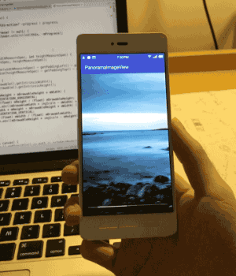
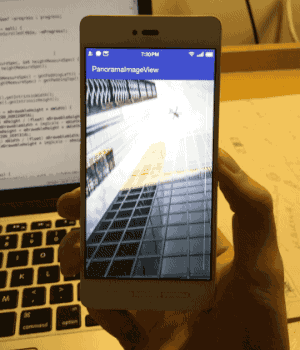

# PanoramaImageView

An imageView can auto scroll with device rotating.

## ScreenShots






## Include PanoramaImageView to Your Project

With gradle:

```groovy
dependencies {
   compile 'com.gjiazhe:PanoramaImageView:1.0'
}
```

## Use PanoramaImageView in Layout File Just Like ImageView

```xml
<com.gjiazhe.panoramaimageview.PanoramaImageView
    android:id="@+id/panorama_image_view"
    android:layout_width="match_parent"
    android:layout_height="match_parent"
    android:src="@drawable/img"
    app:piv_enablePanoramaMode="true"
    app:piv_show_scrollbar="true"
    app:piv_invertScrollDirection="false" />
```
## Description of Attributes
|        Attributes         | Format  | Default |             Description             |
| :-----------------------: | :-----: | :-----: | :---------------------------------: |
|  piv_enablePanoramaMode   | boolean |  true   |   Enable panorama effect or not.    |
|    piv_show_scrollbar     | boolean |  true   |       Show scrollbar or not.        |
| piv_invertScrollDirection | boolean |  false  | Invert the scroll direction or not. |

All the attributes can also be set in java code:

```java
panoramaImageView.setEnablePanoramaMode(true);
panoramaImageView.setEnableScrollbar(true);
panoramaImageView.setInvertScrollDirection(false);
```

## Register the GyroscopeObserver

In Activity or Fragment using PanoramaImageView, you should __register the GyroscopeObserver in onResume()__ and __remember to unregister it in onPause()__.

```java
public class MyActivity extends AppCompatActivity {
  
    private GyroscopeObserver gyroscopeObserver;

    @Override
    protected void onCreate(Bundle savedInstanceState) {
        super.onCreate(savedInstanceState);
        setContentView(R.layout.activity_main);
        // Initialize GyroscopeObserver.
        gyroscopeObserver = new GyroscopeObserver();
        // Set the maximum radian the device should rotate to show image's bounds.
        // It should be set between 0 and π/2.
        // The default value is π/9.
      	gyroscopeObserver.setMaxRotateRadian(Math.PI/9);

        PanoramaImageView panoramaImageView = (PanoramaImageView) findViewById(R.id.panorama_image_view);
        // Set GyroscopeObserver for PanoramaImageView.
        panoramaImageView.setGyroscopeObserver(gyroscopeObserver);
    }

    @Override
    protected void onResume() {
        super.onResume();
        // Register GyroscopeObserver.
        gyroscopeObserver.register(this);
    }

    @Override
    protected void onPause() {
        super.onPause();
        // Unregister GyroscopeObserver.
        gyroscopeObserver.unregister();
    }
}
```

## Set OnPanoramaScrollListener to observe scroll state

If you want to get callback when the image scrolls, set an OnPanoramaScrollListener for PanoramaImageView.

```java
panoramaImageView.setOnPanoramaScrollListener(new PanoramaImageView.OnPanoramaScrollListener() {
    @Override
    public void onScrolled(PanoramaImageView view, float offsetProgress) {
        // Do something here.
        // The offsetProgress range from -1 to 1, indicating the image scrolls
        // from left(top) to right(bottom).
    }
});
```


## License

    MIT License

    Copyright (c) 2016 郭佳哲

    Permission is hereby granted, free of charge, to any person obtaining a copy
    of this software and associated documentation files (the "Software"), to deal
    in the Software without restriction, including without limitation the rights
    to use, copy, modify, merge, publish, distribute, sublicense, and/or sell
    copies of the Software, and to permit persons to whom the Software is
    furnished to do so, subject to the following conditions:
    
    The above copyright notice and this permission notice shall be included in all
    copies or substantial portions of the Software.
    
    THE SOFTWARE IS PROVIDED "AS IS", WITHOUT WARRANTY OF ANY KIND, EXPRESS OR
    IMPLIED, INCLUDING BUT NOT LIMITED TO THE WARRANTIES OF MERCHANTABILITY,
    FITNESS FOR A PARTICULAR PURPOSE AND NONINFRINGEMENT. IN NO EVENT SHALL THE
    AUTHORS OR COPYRIGHT HOLDERS BE LIABLE FOR ANY CLAIM, DAMAGES OR OTHER
    LIABILITY, WHETHER IN AN ACTION OF CONTRACT, TORT OR OTHERWISE, ARISING FROM,
    OUT OF OR IN CONNECTION WITH THE SOFTWARE OR THE USE OR OTHER DEALINGS IN THE
    SOFTWARE.

